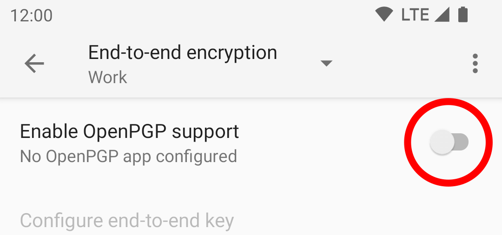
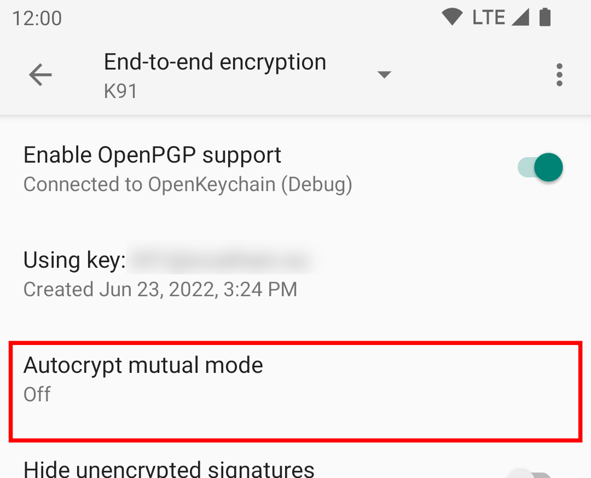
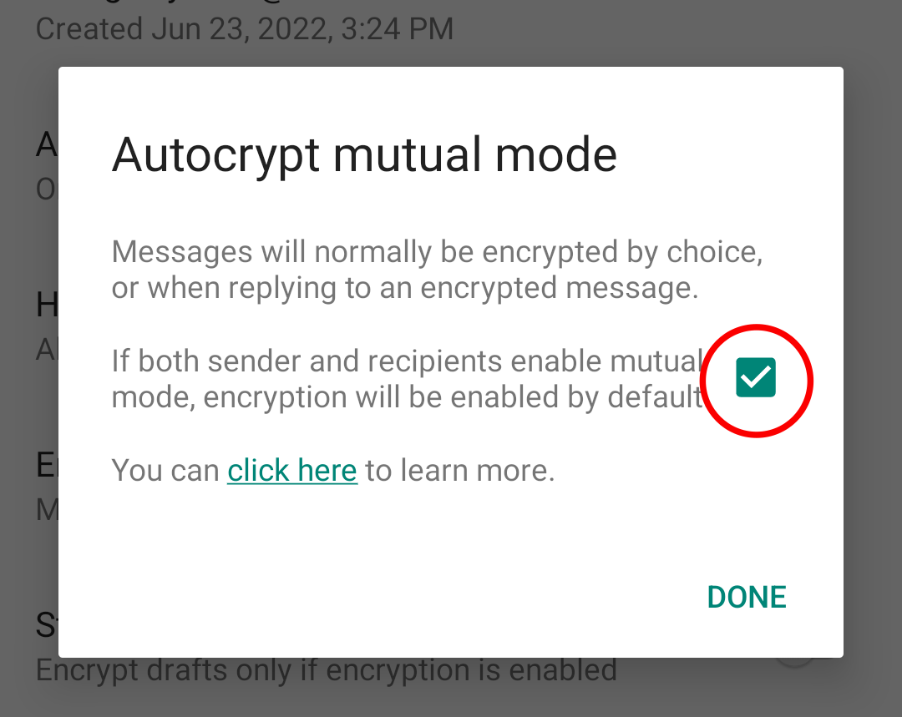
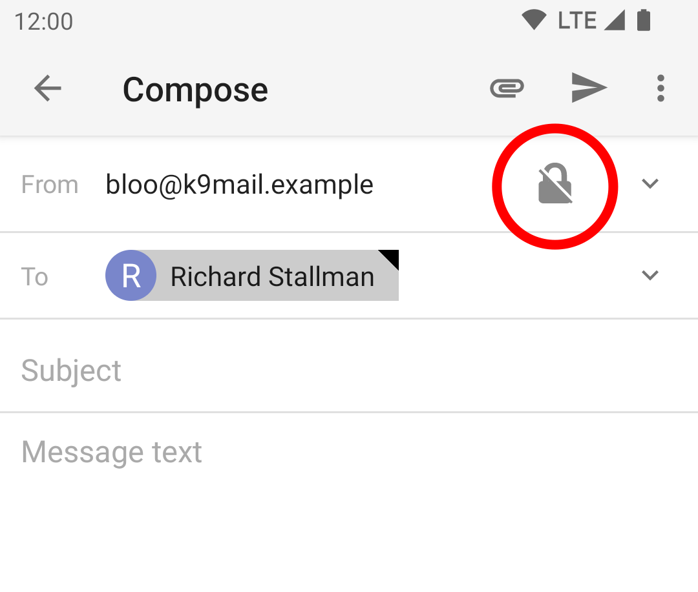
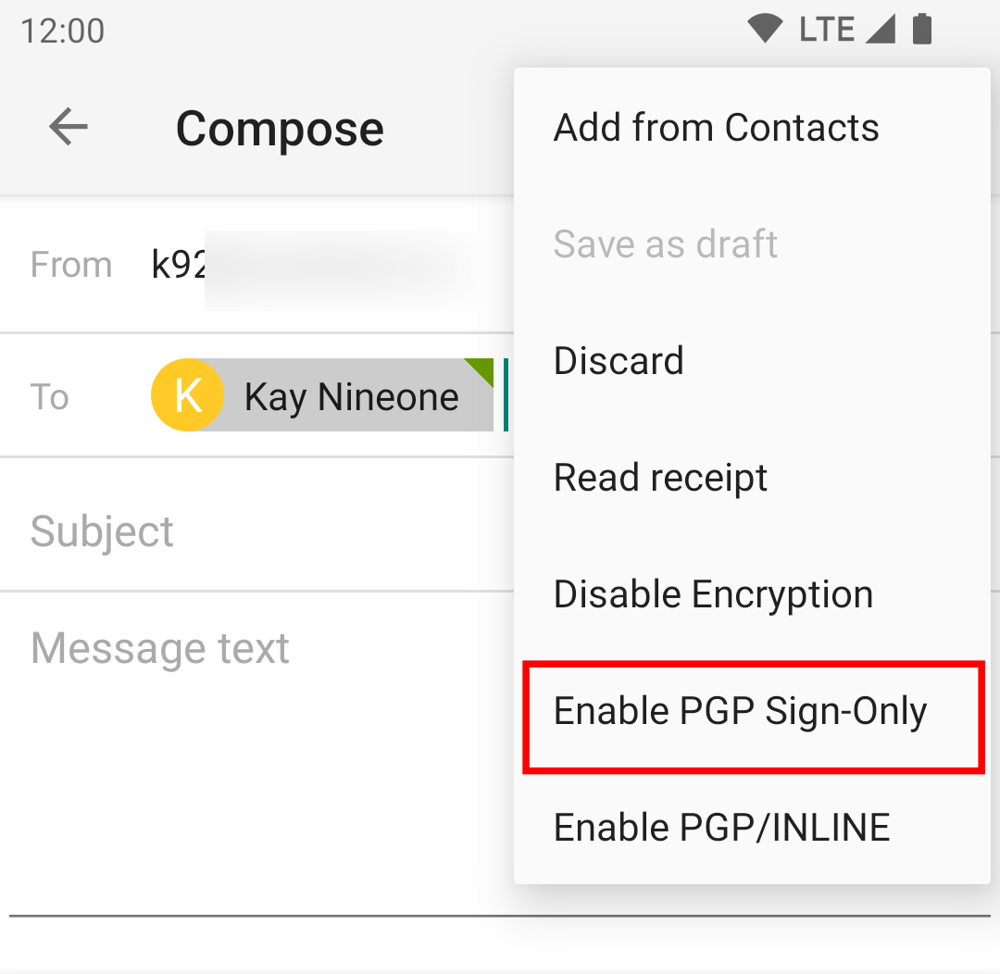
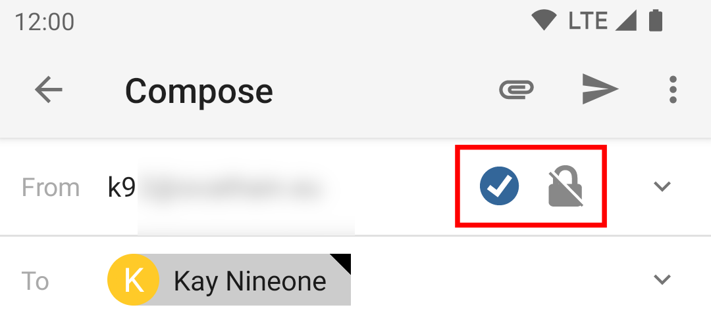
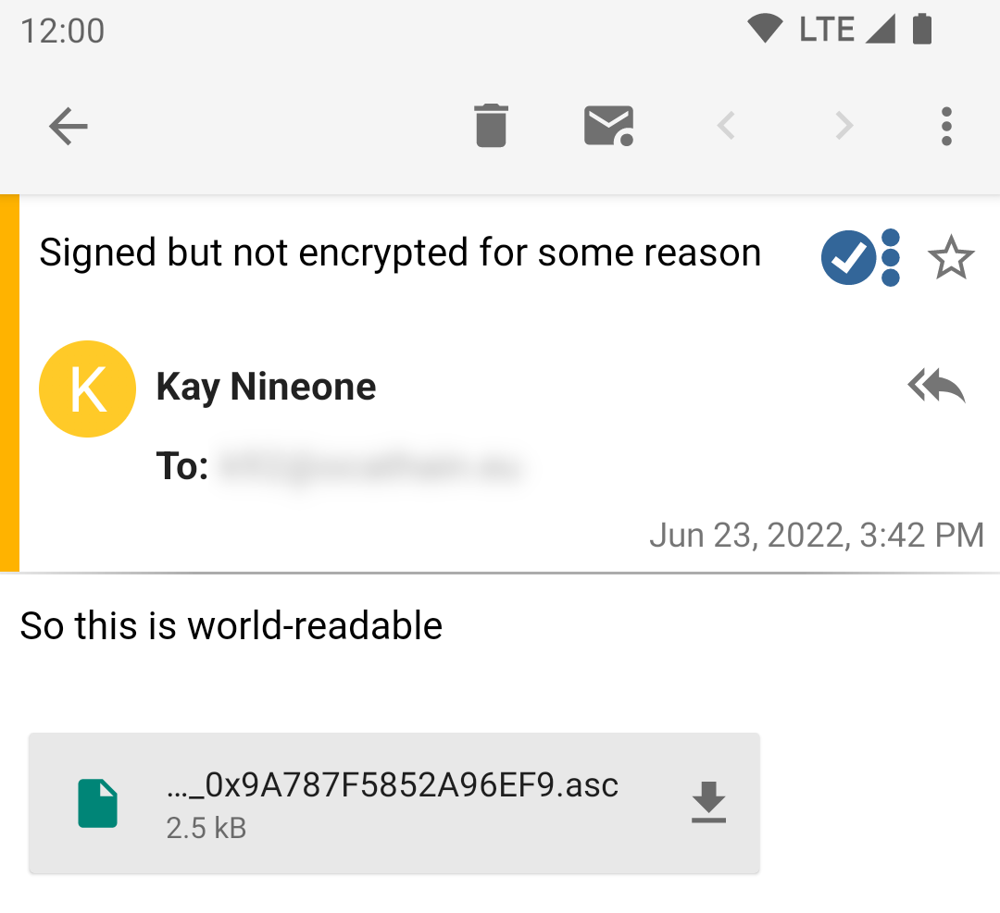

# PGP End-to-end encryption

K-9 Mail does not have built-in encryption capabilities. Instead, it uses an external Android application called
[OpenKeychain](https://www.openkeychain.org/).

## OpenKeychain Usage

### Selecting OpenKeychain as a Crypto Provider

To start using PGP you first need to link OpenKeychain with K-9. To do this:

* Install OpenKeychain from wherever you get your apps
* In K-9, Select Settings -> Accounts
* Choose the account for encryption
* Select End-to-end encryption
* Enable OpenPGP support

### Selecting a Key

Now you'll need to select a key. Click the 'Configure end-to-end key' option.

You'll be sent a screen in the OpenKeychain app:

Select either a key you've already imported/created or create a new key:

See the [OpenKeychain](https://www.openkeychain.org/) website for more information on creating and managing keys.

## Sharing your key with others

Before you send someone an end-to-end encrypted email, you need their public key. They also need your public key.

Some ways to exchange public keys include:

 - meeting in-person (the OpenKeychain application has a convenient interface for mutual key exchange)
 - downloading from the recipient's personal website
 - relying on the [Web of Trust](https://en.wikipedia.org/wiki/Web_of_trust) whereby you trust somebody else's word that a public key is valid
 - downloading the key from a [KeyServer](https://www.rossde.com/PGP/pgp_keyserv.html) (but note the warning on that page about needing to verify the authenticity of keys)
 - using Autocrypt, which includes your key in the header of every email that you send. This is not supported by all mail clients.

K-9 Mail supports the Autocrypt protocol, but it needs to be enabled in the End-to-end encryption settings page:

Tick the box in the popup:

## Signing & Encrypting Mail

When composing e-mail after OpenKeychain has been set up, a new padlock icon
appears in the top right of the composition screen:

(If the icon does not appear, it means that OpenKeychain does not know the PGP keys of any of the recipients)

Tapping the icon enables encryption and turns it green:

For more details on this icon, see [Editing Email Content](../sending/sending_content.md#encryption).

### Sending signed but unencrypted emails

K-9 normally sends mails that are *both* encrypted and signed.

You can also sign the message, which proves it was sent by you, but without encrypting it.
(This is sometimes useful e.g. in public mailing lists)
Choose the "Enable PGP Sign-Only" option in the menu:

The lock will add another icon to confirm you are only signing the message:

Tapping the icon lets you change back to normal end-to-end encryption mode.

## Decrypting & Verifying Signed Mail

When viewing encrypted mail, once configured, K-9 will automatically use OpenKeychain to try to decrypt it with your
key and check the signature.

For encrypted and trusted signed messages it will look like this.

Tapping on the green lock icon brings up this modal:

### Receiving signed but unencrypted emails

For such messages K-9 will look like this:

And tapping on the icon brings up this:

Tapping on the 'View Signer' option will open the contact in OpenKeychain.

## Other PGP settings

The other settings on the end-to-end encryption screen are described in [Account Settings](../settings/account.md#end-to-end-encryption)
